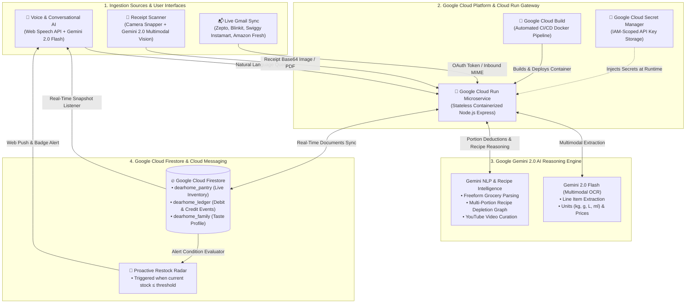

# DearHome - Comprehensive Google Cloud Architecture & System Design

## 1. High-Level Architectural Flow

---

## 2. Layer-by-Layer Technical Specification

### Layer 1: Ingestion Sources & User Interfaces
- **Automated Gmail Quick-Commerce Sync**: One-click Google Identity Services (GIS) authorization. Queries inbox for delivery receipts from `zeptonow.com`, `blinkit.com`, `swiggy.in`, `amazon.in`, and extracts item payloads.
- **Multimodal Bill Scanner**: Dual-engine OCR with live camera viewfinder, in-browser adaptive contrast preprocessing, and Gemini 2.0 Flash multimodal image recognition.
- **Conversational Kitchen Assistant**: Web Speech API voice input connected to the live digital pantry state.

### Layer 2: Google Cloud Run & Serverless Microservice
- **Google Cloud Run**: Autoscaling, stateless containerized microservice on port `8080` (CPU: 1, Memory: 512MiB, Concurrency: 80).
- **Google Cloud Secret Manager**: Binds `Dearhome_api_key` to container environment variables at runtime.
- **Google Cloud Build**: Automated trigger configured in `cloudbuild.yaml` for continuous deployment upon git push.

### Layer 3: Google Gemini 2.0 AI Engine
- **Gemini 2.0 Flash**: Sub-second latency for multimodal image analysis and structured JSON invoice normalization.
- **Taxonomy Normalizer**: Maps regional ingredient names (e.g. *Tamatar* -> *Tomato*, *Atta* -> *Chakki Atta*) to standard inventory keys.

### Layer 4: Persistence & Zero-Waste Engine
- **Google Cloud Firestore**: NoSQL multi-region document store with offline persistence and real-time client snapshot listeners.
- **Recipe Depletion Graph**: Computes ingredient burns based on diner counts (adults, children, guests) and regional spice intensity settings.
