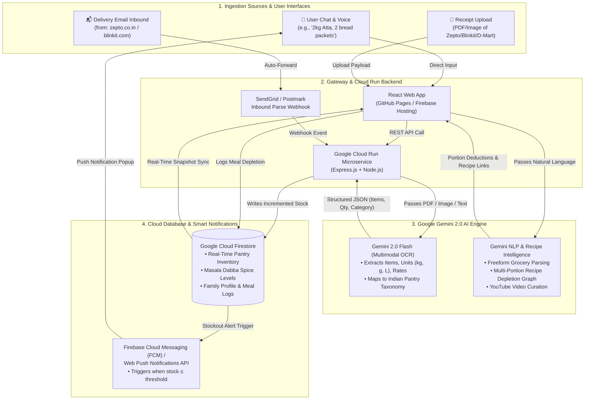

# DearHome - System Architecture & Technical Flow

## 1. High-Level Architectural Flow



---

## 2. Layer-by-Layer Technical Specification

### Layer 1: Ingestion Sources & User Interfaces
- **Conversational Kitchen Onboarding**: AI chat greets user upon first launch and parses compound unpunctuated sentences (e.g. *"I have 2 kg Atta 2 bread packets and 1 kg tomato"*).
- **Multimodal Bill Scanner (Phase 1)**: Universal drag-and-drop / camera upload for digital PDFs and physical thermal receipts (Zepto, Blinkit, Swiggy Instamart, Amazon Fresh, D-Mart).
- **Inbound Email Forwarding Hub (Phase 2)**: Dedicated private mailbox (`sinduja1219@inbox.dearhome.ai`) with 1-time automated Gmail filter routing.
- **Masala Dabba Tracker**: Daily tadka pinch tracking for 7 core Indian spices.
- **Stockout Notification Center**: Header bell with active badge count and native Web Push Notifications API integration.

### Layer 2: Gateway & Serverless Backend
- **Event Gateway**: Inbound email parsing webhook via SendGrid/Postmark.
- **Google Cloud Run Microservice**: Stateless containerized Node.js/Express service handling `/api/parse-bill`, `/api/inbound-webhook`, and `/api/pantry`. Scales to zero when idle for optimal resource and credit efficiency.

### Layer 3: Google Gemini 2.0 Flash AI Engine
- **Multimodal Document Understanding**: Converts unstructured receipt PDFs/photos into structured JSON schemas with zero regex brittle fragility.
- **Taxonomy Normalization**: Maps brand names (e.g., *"Aashirvaad Shudh Chakki Atta 5kg"*) to canonical pantry staples (*"Chakki Atta"*), assigns categories, and calculates burn rates.
- **Recipe Intelligence Graph**: Correlates live kitchen inventory with authentic Indian dishes, generates portion-scaled ingredient deductions, and curates YouTube cooking video links.

### Layer 4: Cloud Persistence & Smart Alerts
- **Google Cloud Firestore**: Real-time NoSQL document store syncing inventory across all household members' devices.
- **Push Notification Dispatcher**: Evaluates threshold breaches (`current <= threshold` or `< 2 days` supply) and dispatches instant push alerts.

---

## 3. Data Schemas & API Contracts

### A. Invoice Extraction Output Schema
```json
{
  "orderId": "#ZPT-88492",
  "platform": "Zepto",
  "orderDate": "2026-09-04T00:30:00Z",
  "totalAmount": 385.00,
  "items": [
    {
      "name": "Amul Taaza Toned Milk (1L)",
      "shortName": "Amul Milk",
      "category": "Dairy and Fresh",
      "qty": 2.0,
      "unit": "L",
      "unitRate": 56.00,
      "totalPrice": 112.00
    },
    {
      "name": "Aashirvaad Shudh Chakki Atta (5kg)",
      "shortName": "Chakki Atta",
      "category": "Atta and Grains",
      "qty": 5.0,
      "unit": "kg",
      "unitRate": 240.00,
      "totalPrice": 240.00
    }
  ]
}
```

### B. Digital Pantry Item Schema
```json
{
  "id": "item-15",
  "name": "Amul Taaza Toned Milk",
  "shortName": "Amul Milk",
  "category": "Dairy and Fresh",
  "current": 2.5,
  "max": 4.0,
  "unit": "L",
  "threshold": 1.0,
  "dailyBurn": 1.0,
  "price": 56.0,
  "lastRestocked": "2026-09-04T00:30:00Z"
}
```

### C. Stockout Notification Schema
```json
{
  "id": "notif-172540192",
  "title": "🚨 Low Stockout Alert: Amul Milk",
  "body": "Only 0.5 L remaining in your kitchen. Estimated runout: Tonight.",
  "time": "Just now",
  "severity": "critical",
  "itemId": "item-15",
  "unread": true,
  "quickReorderPlatform": "Zepto"
}
```

---

## 4. Google Cloud Service Mapping & Credit Utilization

| GCP Component | Role | Resource Efficiency |
| :--- | :--- | :--- |
| **Gemini 2.0 Flash** *(Vertex AI)* | Receipt Multimodal OCR & NLP | Sub-second extraction with lowest cost per token |
| **Cloud Run** | Backend Event & Webhook API | Scale-to-zero serverless architecture |
| **Cloud Firestore** | Real-Time Pantry Database | Instant multi-device sync with native listeners |
| **Firebase Cloud Messaging** | Device Stockout Push Alerts | Reliable low-latency push notifications |
| **Firebase Hosting** | Web Application Delivery | Fast CDN caching and SSL edge routing |

---

## 5. Security & Privacy
- **Zero-Storage Inbound Policy**: Temporary invoice payloads are parsed in memory and never persisted in raw email form.
- **End-to-End Encryption**: All webhook and REST endpoints communicate over strict TLS 1.3.
- **Scoped Permissions**: Google OAuth integrations utilize restricted read-only query filters (`from:(zepto.co.in OR blinkit.com)`).
