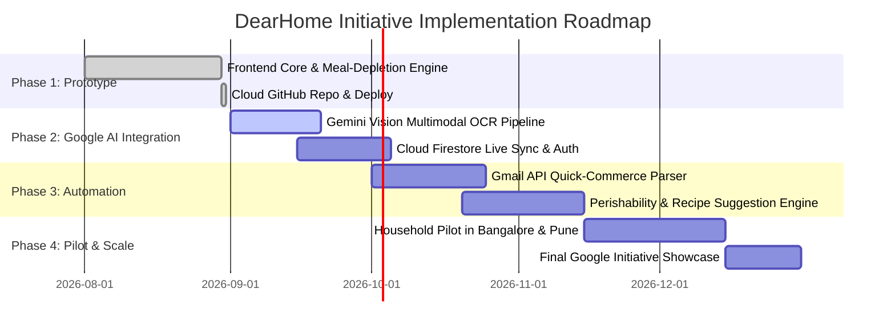

# 📄 Google Initiative Project Proposal & Implementation Plan

## **Project Title:**
### **DearHome: Autonomous Multi-Agent Kitchen Inventory & Food-Waste Prevention Engine Powered by Google Gemini & Cloud**

* **Lead Submitter:** Sinduja
* **Contact Email:** [Sinduja1219@gmail.com](mailto:Sinduja1219@gmail.com)
* **Live Working App:** [https://sindujag.github.io/dearhome/](https://sindujag.github.io/dearhome/)
* **Target Initiative:** Google Pachamama / AI for Sustainability
* **Aligned UN Sustainable Development Goals:** **UN SDG 12** (*Responsible Consumption & Food Waste Reduction*), **UN SDG 11** (*Sustainable Cities & Logistics*)

---

## 1. Executive Summary

In urban Indian households, kitchen inventory management is an overwhelming mental burden characterized by **unexpected stockouts** (running out of Atta, Dals, or Milk mid-cooking) and **unconscious food waste** (perishables and dairy spoiling in refrigerators). 

**DearHome** is a revolutionary, hands-off household management platform that puts kitchen inventory on complete autopilot. Powered by **Google Gemini Multimodal Vision** and **Vertex AI**, DearHome replaces tedious manual bookkeeping with an intelligent **Multi-Agent System** that:
1. Automatically deduces and deducts raw ingredient consumption when users simply log their daily cooked meals (e.g. *“Dal Tadka & Rice for 4 family members + 2 guests”*).
2. Autonomously ingests incoming purchases by parsing digital invoices from quick-commerce apps (Zepto, Blinkit, Amazon Fresh) via the **Gmail API** and digitizing physical supermarket receipts (D-Mart, Reliance) using **Gemini Multimodal OCR**.
3. Forecasts stockout timelines and eliminates food waste through predictive restock radars and perishability alerts.

---

## 2. Problem Statement & Market Context

### The Challenge in Indian Kitchen Dynamics:
* **The Manual Tracking Failure:** Standard western inventory apps require users to manually type item weights, scan barcodes, or log subtractions every time they use salt or flour. Indian cooking uses dynamic pinch-based and handful-based proportions across complex multi-dish meals, making manual apps fail within 3 days.
* **The Food Waste Crisis (UN SDG 12.3):** India loses millions of tonnes of household food annually due to forgotten produce, over-purchasing, and expiry blindness.
* **Erratic Quick-Commerce Logistics:** Frequent unexpected stockouts drive impulsive single-item quick-commerce orders, exponentially increasing hyper-local delivery traffic and carbon emissions.

---

## 3. The Solution: Multi-Agent AI System

DearHome divides household management into **4 specialized autonomous AI agents**:

```mermaid
graph TD
    subgraph Multi_Agent_Core ["DearHome Multi-Agent AI Architecture"]
        A1["🍳 1. Culinary Depletion Agent<br><i>(Vertex AI / Gemini Reasoning)</i>"]
        A2["🧾 2. Vision OCR Ingestion Agent<br><i>(Gemini Flash Multimodal + Gmail API)</i>"]
        A3["⚠️ 3. Zero-Stockout Radar Agent<br><i>(Predictive Consumption Modeling)</i>"]
        A4["🌱 4. Eco & Food-Waste Agent<br><i>(Perishability & Spoilage Prevention)</i>"]
    end

    A1 <--> CloudDB[(Google Cloud Firestore)]
    A2 <--> CloudDB
    A3 <--> CloudDB
    A4 <--> CloudDB
```

1. **🍳 Culinary & Recipe Depletion Agent ("Chef Agent"):**
   * Pre-trained on authentic Indian regional recipe ingredient weights (North Indian, South Indian, Maharashtrian, Gujarati, Punjabi).
   * Dynamically adjusts serving weights based on household composition (Adults, Children, Elders) and temporary dinner guests.
2. **🧾 Omnichannel Ingestion Agent ("Ingestion Agent"):**
   * Multi-modal OCR via **Gemini 2.0 Flash** extracts line items, pack sizes, and prices from thermal supermarket receipts (D-Mart, Reliance, Kiranas).
   * **Google Gmail API** listens for digital invoice emails from delivery apps to auto-increment stock with zero user effort.
3. **⚠️ Zero-Stockout Predictive Radar Agent ("Guardian Agent"):**
   * Models household burn rates to compute exact "Days of Supply" remaining.
   * Compiles low-stock essentials into a **1-Click Smart Restock Cart**.
4. **🌱 Eco & Food-Waste Prevention Agent ("Eco Agent"):**
   * Tracks shelf-life timelines of perishables (Milk: 2 days, Dahi: 4 days, Tomatoes: 6 days).
   * Sends proactive reminders and suggests recipes to consume items before they spoil.

---

## 4. Google Product Stack Mapping

| Layer | Google Product | Architectural Purpose |
| :--- | :--- | :--- |
| **Multimodal Perception** | **Gemini 2.0 / 1.5 Flash** | OCR parsing of non-standard Indian supermarket thermal receipts & handwritten Kirana bills. |
| **Reasoning Engine** | **Vertex AI (Gemini Reasoning)** | Dynamic ingredient decomposition and portion scaling across diverse Indian regional recipes. |
| **Digital Ingestion** | **Google Gmail API & Pub/Sub** | Automated webhook integration to parse e-commerce and delivery receipts directly from user's Gmail. |
| **Database & Sync** | **Cloud Firestore** | Real-time, offline-ready NoSQL cloud database syncing inventory across all household members. |
| **Media Storage** | **Google Cloud Storage (GCS)** | Secure cloud bucket storage for uploaded receipt images and invoice PDFs. |
| **Hosting & Compute** | **Firebase Hosting & Cloud Run** | High-performance, scalable serverless backend and global web app hosting. |

---

## 5. Multi-Phase Implementation Plan

### **Phase 1: Foundation & Prototype (Completed)**
* ✅ Built interactive digital pantry with Indian staples, Masala Dabba spice box, and Days-of-Supply gauges.
* ✅ Developed the **"What Did You Cook?"** meal logger with dynamic family and guest multiplier.
* ✅ Deployed cloud-hosted interactive prototype.

### **Phase 2: Google Cloud & AI Integration (Month 1–2)**
* Connect **Gemini 2.0 Flash API** endpoint for live camera photo uploads of supermarket cash receipts.
* Set up **Google Cloud Firestore** for real-time multi-user family synchronization and **Firebase Authentication** (Google Sign-In).

### **Phase 3: Autonomous Webhooks & Perishability Engine (Month 2–3)**
* Deploy **Google Cloud Run** microservice linked with the **Gmail API** to securely ingest digital invoices from Zepto, Blinkit, Instamart, and Amazon Fresh.
* Implement the Eco-Agent's perishable shelf-life tracking and spoilage prevention notifications.

### **Phase 4: Pilot Testing & Showcase (Month 3–4)**
* Run a closed beta pilot across 100 Indian households in Bangalore and Pune to refine machine-learned portion estimates.
* Prepare final demonstration metrics showcasing **reduced food waste percentage** and **elimination of household stockout events**.

---

## 6. Social & Sustainability Impact (Google Pachamama Alignment)

1. **Halving Household Food Waste (UN SDG 12.3):** Proactive perishability warnings ensure fresh vegetables and dairy are consumed before spoiling.
2. **Consolidated Logistics & Carbon Footprint Reduction (UN SDG 11):** By forecasting weekly kitchen needs and grouping restocks into consolidated baskets, DearHome reduces erratic single-item quick-commerce delivery trips.
3. **Gender & Domestic Equity:** Automates kitchen inventory management, drastically reducing the unpaid cognitive mental load of home management.

---

## 👥 Submitter Contact
* **Lead Submitter:** Sinduja
* **Contact Email:** [Sinduja1219@gmail.com](mailto:Sinduja1219@gmail.com)
* **Live Demonstration:** [https://sindujag.github.io/dearhome/](https://sindujag.github.io/dearhome/)
