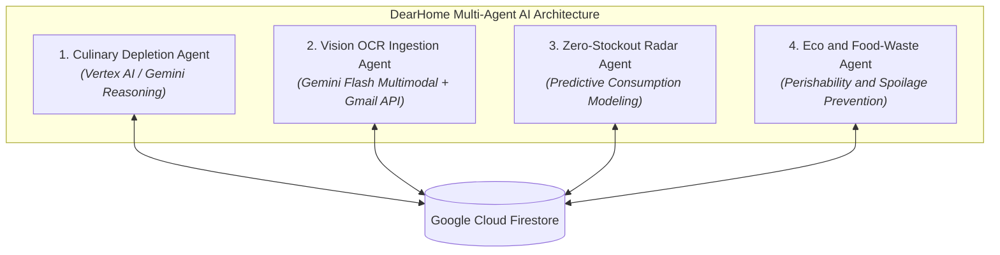
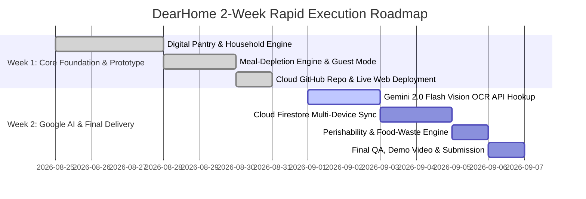

# Google Initiative Project Proposal and Implementation Plan

## Project Title:
### DearHome: Autonomous Multi-Agent Kitchen Inventory and Food-Waste Prevention Engine Powered by Google Gemini and Cloud

- Lead Submitter: Sinduja
- Contact Email: Sinduja1219@gmail.com
- Live Working App: https://sindhuja-ramesh.github.io/dearhome/
- Cloud Source Repository: https://github.com/sindhuja-ramesh/dearhome
- Target Initiative: Google Patchamomma / AI for Sustainability
- Aligned UN Sustainable Development Goals: UN SDG 12 (Responsible Consumption and Food Waste Reduction), UN SDG 11 (Sustainable Cities and Logistics)

---

## 1. Executive Summary

In urban Indian households, kitchen inventory management is an overwhelming mental burden characterized by unexpected stockouts (running out of Atta, Dals, or Milk mid-cooking) and unconscious food waste (perishables and dairy spoiling in refrigerators). 

DearHome is a revolutionary, hands-off household management platform that puts kitchen inventory on complete autopilot. Powered by Google Gemini Multimodal Vision and Vertex AI, DearHome replaces tedious manual bookkeeping with an intelligent Multi-Agent System that:
1. Automatically deduces and deducts raw ingredient consumption when users simply log their daily cooked meals (e.g. "Dal Tadka and Rice for 4 family members plus 2 guests").
2. Autonomously ingests incoming purchases by parsing digital invoices from quick-commerce apps (Zepto, Blinkit, Amazon Fresh) via the Gmail API and digitizing physical supermarket receipts (D-Mart, Reliance) using Gemini Multimodal OCR.
3. Forecasts stockout timelines and eliminates food waste through predictive restock radars and perishability alerts.

---

## 2. Problem Statement and Market Context

### The Challenge in Indian Kitchen Dynamics:
- The Manual Tracking Failure: Standard western inventory apps require users to manually type item weights, scan barcodes, or log subtractions every time they use salt or flour. Indian cooking uses dynamic pinch-based and handful-based proportions across complex multi-dish meals, making manual apps fail within 3 days.
- The Food Waste Crisis (UN SDG 12.3): India loses millions of tonnes of household food annually due to forgotten produce, over-purchasing, and expiry blindness.
- Erratic Quick-Commerce Logistics: Frequent unexpected stockouts drive impulsive single-item quick-commerce orders, exponentially increasing hyper-local delivery traffic and carbon emissions.

---

## 3. The Solution: Multi-Agent AI System

DearHome divides household management into 4 specialized autonomous AI agents:

1. Culinary and Recipe Depletion Agent ("Chef Agent"):
   - Pre-trained on authentic Indian regional recipe ingredient weights (North Indian, South Indian, Maharashtrian, Gujarati, Punjabi).
   - Dynamically adjusts serving weights based on household composition (Adults, Children, Elders) and temporary dinner guests.
2. Omnichannel Ingestion Agent ("Ingestion Agent"):
   - Multi-modal OCR via Gemini 2.0 Flash extracts line items, pack sizes, and prices from thermal supermarket receipts (D-Mart, Reliance, Kiranas).
   - Google Gmail API listens for digital invoice emails from delivery apps to auto-increment stock with zero user effort.
3. Zero-Stockout Predictive Radar Agent ("Guardian Agent"):
   - Models household burn rates to compute exact "Days of Supply" remaining.
   - Compiles low-stock essentials into a 1-Click Smart Restock Cart.
4. Eco and Food-Waste Prevention Agent ("Eco Agent"):
   - Tracks shelf-life timelines of perishables (Milk: 2 days, Dahi: 4 days, Tomatoes: 6 days).
   - Sends proactive reminders and suggests recipes to consume items before they spoil.

---

## 4. Google Product Stack Mapping

| Layer | Google Product | Architectural Purpose |
| :--- | :--- | :--- |
| Multimodal Perception | Gemini 2.0 / 1.5 Flash | OCR parsing of non-standard Indian supermarket thermal receipts and handwritten Kirana bills. |
| Reasoning Engine | Vertex AI (Gemini Reasoning) | Dynamic ingredient decomposition and portion scaling across diverse Indian regional recipes. |
| Digital Ingestion | Google Gmail API and Pub/Sub | Automated webhook integration to parse e-commerce and delivery receipts directly from user's Gmail. |
| Database and Sync | Cloud Firestore | Real-time, offline-ready NoSQL cloud database syncing inventory across all household members. |
| Media Storage | Google Cloud Storage (GCS) | Secure cloud bucket storage for uploaded receipt images and invoice PDFs. |
| Hosting and Compute | Firebase Hosting and Cloud Run | High-performance, scalable serverless backend and global web app hosting. |

---

## 5. Rapid Week-by-Week Implementation Plan (2-Week Execution)

The project follows a rapid 2-week execution schedule designed for swift deployment and completion:

### Week 1: Core Architecture, Multi-Agent Logic & Live Web App (Completed)
- Day 1-2: Designed the Indian pantry database, Si units unit conversion, and 7-spice Masala Dabba tracker.
- Day 3-4: Developed the "What Did You Cook?" dynamic recipe deduction engine with family and guest multipliers.
- Day 5-6: Integrated Restock Radar, Quick-Commerce simulation (Zepto, Blinkit), and OCR simulation (D-Mart).
- Day 7: Deployed 100% cloud-hosted interactive prototype live on GitHub Pages with persistent browser storage.

### Week 2: Google AI Integration, Cloud Backend & Final Delivery (Target Completion: Within 7 Days)
- Day 8-9 (Days 1-2 of Week 2): Connect live Google Gemini 2.0 Flash Vision API endpoint for camera receipt scanning.
- Day 10-11 (Days 3-4 of Week 2): Connect Google Cloud Firestore for real-time cloud multi-user sync and Firebase Auth.
- Day 12-13 (Days 5-6 of Week 2): Complete the Eco-Agent food-waste perishability notifications and quick-commerce 1-click cart exporter.
- Day 14 (Day 7 of Week 2): Final end-to-end verification, demo video recording, and official submission to Google Patchamomma.

---

## 6. Social and Sustainability Impact (Google Patchamomma Alignment)

1. Halving Household Food Waste (UN SDG 12.3): Proactive perishability warnings ensure fresh vegetables and dairy are consumed before spoiling.
2. Consolidated Logistics and Carbon Footprint Reduction (UN SDG 11): By forecasting weekly kitchen needs and grouping restocks into consolidated baskets, DearHome reduces erratic single-item quick-commerce delivery trips.
3. Gender and Domestic Equity: Automates kitchen inventory management, drastically reducing the unpaid cognitive mental load of home management.

---

## Submitter Contact
- Lead Submitter: Sinduja
- Contact Email: Sinduja1219@gmail.com
- Target Initiative: Google Patchamomma / AI for Sustainability
- Live Demonstration: https://sindhuja-ramesh.github.io/dearhome/
