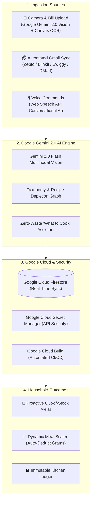

# 🍳 DearHome - Autonomous AI Kitchen Operating System & Zero-Waste Engine

> **"DearHome auto-syncs grocery bills from Gmail and receipt scans into a live digital pantry, alerts you before essentials run out of stock, and tells you what to cook with on-hand ingredients—powered by Google Gemini 2.0 AI."**

- **Lead Submitter**: Sindhuja Ramesh
- **Contact Email**: Sinduja1219@gmail.com
- **Live Web Application**: [https://sindhuja-ramesh.github.io/dearhome/](https://sindhuja-ramesh.github.io/dearhome/)
- **Target Initiative**: Google Event / AI for Sustainability (UN SDG 12: Responsible Consumption)
- **Architecture Documentation**: [ARCHITECTURE.md](ARCHITECTURE.md)
- **Full Proposal & Plan**: [PROPOSAL.md](PROPOSAL.md)

---

## 🌟 What is DearHome?

Every day, millions of households face the same daily friction:
1. **Silent Stockouts**: Discovering you are out of milk or cooking oil mid-recipe.
2. **Food Waste**: Forgotten perishables rotting in the back of the refrigerator.
3. **Paper Invoice Clutter**: Stacks of thermal receipts and manual grocery tracking friction.
4. **Cooking Indecision**: The eternal question: *"What should I cook tonight with what I already have?"*

**DearHome** transforms the modern kitchen into an autonomous, paperless, zero-waste smart hub. By connecting directly to **Gmail** for 10-minute grocery delivery invoices (Zepto, Blinkit, Swiggy Instamart) and utilizing **Google Gemini 2.0 Multimodal Vision** with in-browser canvas OCR, DearHome maintains a real-time digital pantry, pushes proactive restock alerts before items run dry, and features a voice-enabled AI assistant that suggests authentic recipes based strictly on expiring ingredients.

---

## 🏛️ System Architecture

---

## 🚀 Core Capabilities

### 1. 📸 Dual-Engine Multimodal Receipt OCR
- **Google Gemini 2.0 Flash Multimodal Vision**: Ingests paper receipts from Zepto, Blinkit, Swiggy Instamart, BigBasket, DMart, Amazon Fresh, and local Kirana store thermal bills.
- **In-Browser Canvas Preprocessor & Tesseract.js**: Applies grayscale contrast stretching to sharpen faint thermal dot-matrix text.
- **Live Camera Viewfinder**: Snap bills directly inside the app with instant alignment guidelines.
- **Interactive Raw Text Editor**: View and edit detected OCR lines with instant `⚡ Re-Parse Text` capabilities.

### 2. 📬 Automated Gmail & Delivery App Sync
- Auto-ingests digital invoices from quick-commerce apps directly from order confirmation emails.
- Zero manual typing: instantly converts receipts into structured items, exact quantities (`kg`, `g`, `L`, `ml`, `packets`, `pcs`), and prices.

### 3. 🚨 Proactive Out-of-Stock & Expiry Notification Engine
- Monitors customizable minimum inventory thresholds (e.g. notify when Milk drops below 1.5L or Atta below 3kg).
- Real-time shelf-life radar highlights perishables within their critical 3-day window.

### 4. 🎙️ Voice-Enabled Zero-Waste AI Sous Chef
- Hands-free kitchen conversational intelligence aware of live pantry stock.
- Ask: *"What can I cook with expiring items?"* or *"Do I have enough Basmati Rice for 4 people?"*.
- Suggests authentic recipes matching **only** what is physically in stock to eliminate food waste.

### 5. 🍲 Dynamic Family & Guest Portion Scaler
- Select diners (Adults, Children, Guests) and appetite levels (Light, Standard, Heavy).
- Automatically calculates and deducts the exact grams/liters of ingredients used from live stock upon cooking, recording every transaction in an immutable Kitchen Ledger.

---

## 🛠️ Google Technology Stack

| Google Technology | Role in DearHome |
| :--- | :--- |
| **Google Gemini 2.0 / 1.5 Flash** | Multimodal OCR parsing of receipt images and zero-waste recipe reasoning |
| **Google Cloud Firestore** | Real-time multi-device cloud pantry synchronization |
| **Google Cloud Secret Manager** | Secure, enterprise-grade storage of API keys |
| **Google Cloud Build** | Automated continuous deployment pipeline |
| **Gmail API / Workspace** | Direct ingestion of digital delivery receipts |
| **Web Speech API** | Hands-free voice recognition for conversational kitchen assistant |

---

## 📚 Complete Documentation Links

- 📖 **System Architecture Deep-Dive**: [ARCHITECTURE.md](ARCHITECTURE.md)
- 💡 **Competition Proposal & UN SDG Alignment**: [PROPOSAL.md](PROPOSAL.md)
- ⚙️ **Cloud Build Pipeline**: [cloudbuild.yaml](cloudbuild.yaml)
- 🚀 **Live Web Application**: [https://sindhuja-ramesh.github.io/dearhome/](https://sindhuja-ramesh.github.io/dearhome/)

---

## 👥 Submitter Contact
- **Lead Submitter**: Sindhuja Ramesh
- **Email**: Sinduja1219@gmail.com
