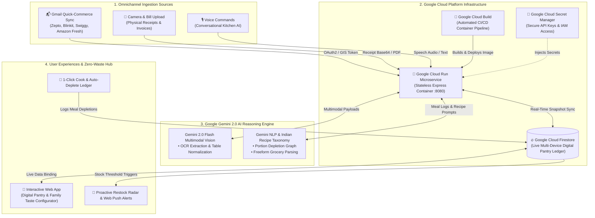

# 🍳 DearHome - Autonomous AI Kitchen Operating System & Zero-Waste Engine

> **"DearHome puts kitchen inventory on complete autopilot: auto-syncs grocery bills from Gmail (Zepto, Blinkit, Swiggy Instamart, Amazon Fresh), digitizes physical receipts with Google Gemini 2.0 Multimodal Vision, alerts you before essentials run out, and deduces ingredient depletion upon cooking authentic Indian meals."**

- **Lead Submitter**: Sindhuja Ramesh
- **GCP Owner Account**: `gurudhev21@gmail.com`
- **Cloud Infrastructure**: **Google Cloud Run** + **Google Cloud Firestore** + **Google Cloud Build**
- **AI Core**: **Google Gemini 2.0 Flash Multimodal Vision & Reasoning**
- **Target Initiative**: Google Event / AI for Sustainability (UN SDG 12: Responsible Consumption)
- **Live Deployment (Cloud Run)**: Containerized Microservice on Google Cloud
- **Frontend SPA**: [https://sindhuja-ramesh.github.io/dearhome/](https://sindhuja-ramesh.github.io/dearhome/)

---

## 🌟 What is DearHome?

DearHome solves the daily friction of Indian household management:
1. **Silent Stockouts**: Running out of Atta, Dals, Cooking Oil, or Milk mid-recipe.
2. **Food Waste (UN SDG 12.3)**: Perishables rotting unnoticed in refrigerators.
3. **Receipt Clutter & Quick-Commerce Overhead**: Stacks of thermal receipts and manual bookkeeping fatigue.
4. **Cooking Indecision**: *"What can I cook tonight with ingredients expiring in 48 hours?"*

---

## 🏛️ Comprehensive Google Cloud Services Architecture

DearHome is built natively on Google Cloud services:



---

## 🚀 Deploying DearHome on Google Cloud Run in 1 Command

### Prerequisites
- GCP Console Account: `gurudhev21@gmail.com`
- Google Cloud SDK (`gcloud`) installed

### 1-Click Cloud Run Deployment via Cloud Build:
```bash
# 1. Authorize gcloud
gcloud auth login gurudhev21@gmail.com
gcloud config set project abiding-team-430904-g6

# 2. Submit Cloud Build pipeline (builds container & deploys to Cloud Run)
gcloud builds submit --config cloudbuild.yaml
```

### Direct Manual Cloud Run Deploy:
```bash
# Build and deploy container directly
gcloud run deploy dearhome \
  --source . \
  --region us-central1 \
  --platform managed \
  --allow-unauthenticated \
  --port 8080 \
  --set-env-vars FIREBASE_PROJECT_ID=abiding-team-430904-g6,NODE_ENV=production \
  --set-secrets GEMINI_API_KEY=Dearhome_api_key:latest
```

---

## 📦 Key Capabilities

1. **📬 Live Gmail Quick-Commerce Auto-Sync**:
   - Queries Gmail for `from:(zeptonow.com OR blinkit.com OR swiggy.in OR amazon.in)` invoices.
   - Extracts item names, quantities, and rates with Gemini 2.0 Flash.
   - Auto-updates pantry stock with 1-click batch ingestion.
2. **📸 Dual-Engine Multimodal Receipt OCR**:
   - Camera photo snapper + in-browser preprocessor + Gemini 2.0 Flash Multimodal Vision OCR.
3. **🍳 Indian Family Taste Profile & Scaler**:
   - Configures regional roots (*Punjabi*, *Tamil Nadu*, *Bengali*, *Maharashtrian*), cooking oil preferences (*Desi Ghee*, *Mustard Oil*, *Sunflower Oil*), and temporary diner guests.
4. **🔥 Real-Time Google Cloud Firestore Ledger**:
   - Multi-device instant synchronization across mobile, desktop, and kitchen tablets.
5. **⏰ 24/7 Unattended Google Apps Script Trigger**:
   - Free background worker (`scripts/gmail_pantry_sync.gs`) that continuously syncs orders without needing the browser open.
