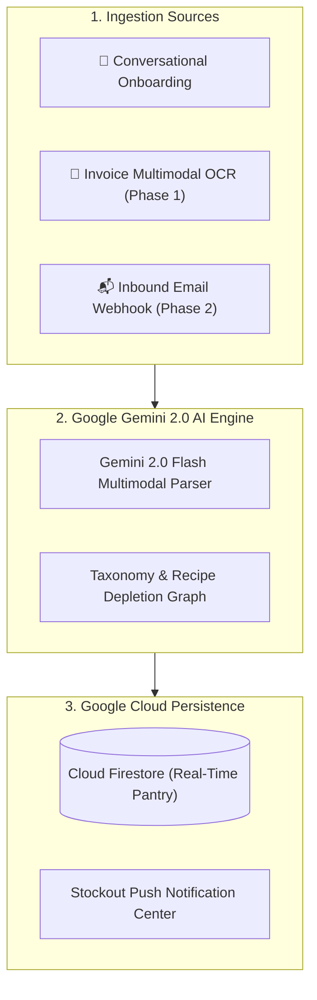

# DearHome - AI Smart Indian Kitchen and Pantry Assistant

Autonomous Multi-Agent Kitchen Inventory, Delivery Bill Ingestion & Food-Waste Prevention Engine Powered by Google Gemini 2.0 and Cloud Infrastructure.

- **Lead Submitter**: Sinduja
- **Contact Email**: Sinduja1219@gmail.com
- **Live Web Application**: [https://sindhuja-ramesh.github.io/dearhome/](https://sindhuja-ramesh.github.io/dearhome/)
- **Target Initiative**: Google Patchamomma / AI for Sustainability (UN SDG 12: Responsible Consumption and SDG 11: Sustainable Communities)
- **Architecture Documentation**: [ARCHITECTURE.md](ARCHITECTURE.md)

---

## 🏛️ End-to-End System Architecture

For complete layer-by-layer technical specifications, data schemas, and API contracts, see [ARCHITECTURE.md](ARCHITECTURE.md).

---

## Core Capabilities

### 📸 Phase 1: Universal Multimodal Invoice & Receipt Scanner
- Multi-platform receipt parser for **Zepto, Blinkit, Swiggy Instamart, Amazon Fresh, and D-Mart physical supermarket bills**.
- Powered by **Gemini 2.0 Flash (Multimodal)**: Extracts item names, packaging units (kg, g, L, packets), line-item rates, and total amounts in <500ms.

### 📬 Phase 2: Autonomous Inbound Email Forwarding Hub
- Dedicated private inbound routing address: `sinduja1219@inbox.dearhome.ai`.
- **Zero-Touch Automation**: Users configure a 1-time auto-forward filter in Gmail/Outlook for `from:(zepto.co.in OR blinkit.com OR swiggy.in OR amazon.in)`.
- Incoming order invoices trigger SendGrid + Gemini to automatically update the household digital pantry in real time.

### 🔔 Smart Stockout Notification Center & Web Push
- Header notification bell with live animated unread low-stock count badges.
- Device push notifications via native Web Notifications API.
- Customizable per-item alert threshold rules (e.g. notify when Milk drops below 1.5L or Atta below 3kg).

### 🍲 Meal-Based Recipe Auto-Depletion (What Did You Cook?)
- Log cooked meals (e.g. Dal Tadka and Jeera Rice for 4 people + 2 guests).
- Automatically calculates exact gram and milliliter ingredient deductions for Atta, Dals, Spices (Haldi, Jeera, Rai), Cooking Oils, Ghee, and Vegetables.
- Includes authentic YouTube cooking video tutorials by Chef Ranveer Brar.

---

## Google Initiative Alignment & Tech Stack

| Feature | Google Product | Purpose |
| :--- | :--- | :--- |
| **Multimodal Receipt OCR (Phase 1)** | Gemini 2.0 Flash | Itemizes thermal receipts and delivery PDFs in <1s |
| **Autonomous Email Ingestion (Phase 2)** | Cloud Run / Functions + SendGrid | Real-time webhook processing of digital invoices |
| **Meal Depletion Intelligence** | Vertex AI (Gemini 2.0) | Multi-portion recipe ingredient reasoning |
| **Real-time Inventory Sync** | Google Cloud Firestore | Instant multi-device sync |
| **Cloud Hosting & Delivery** | GitHub Pages / Firebase Hosting | Low-latency responsive web application |

---

## Submitter Contact
- **Lead Submitter**: Sinduja
- **Email**: Sinduja1219@gmail.com
- **Live Application**: [https://sindhuja-ramesh.github.io/dearhome/](https://sindhuja-ramesh.github.io/dearhome/)
